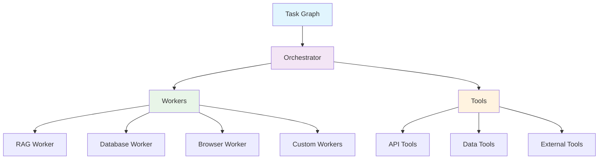

# 🧠 Arklex AI · The Ultimate Agent-First Framework

<div align="center">


**Build, deploy, and scale intelligent AI agents with enterprise-grade reliability**

[](https://github.com/arklexai/Agent-First-Organization/releases)
[](https://pypi.org/project/arklex)
[](https://pypi.org/project/arklex)
[](LICENSE)
[](https://github.com/arklexai/Agent-First-Organization)
[](https://discord.gg/arklex)
[](https://twitter.com/arklexai)

[🚀 Quick Start](#-get-started-in-5-minutes) • [📚 Documentation](https://arklex.ai/docs) • [💡 Examples](./examples/) • [💬 Community](https://github.com/arklexai/Agent-First-Organization/discussions)

</div>

---

## 🎯 The Future of AI Automation is Here

**Stop building AI agents from scratch. Start deploying intelligent automation that actually works.**

Arklex AI is the definitive framework for building production-ready intelligent agents that scale. Whether you're automating customer service, managing e-commerce operations, or orchestrating complex business workflows, Arklex AI gives you the tools to deploy enterprise-grade AI agents in days, not months.

### ⚡ Why Leading Companies Choose Arklex AI

- **🚀 90% Faster Development** — Deploy agents in days, not months
- **🧠 Agent-First Design** — Purpose-built for multi-agent orchestration
- **🔌 Model Agnostic** — Seamlessly switch between OpenAI, Anthropic, Gemini, and more
- **📊 Built-in Evaluation** — Comprehensive testing suite with synthetic data generation
- **🛡️ Enterprise Security** — Secure by design with authentication and rate limiting
- **⚡ Production Ready** — Monitoring, logging, and auto-scaling out of the box

---

## 🚀 Get Started in 5 Minutes

### Step 1: Install Arklex AI

```bash
# Install the core framework
pip install arklex

# Or install with all features
pip install arklex[all]
```

### Step 2: Set Up Your Environment

Create a `.env` file with your API keys:

```env
# Choose your preferred LLM provider
OPENAI_API_KEY=your_openai_key_here
# OR
ANTHROPIC_API_KEY=your_anthropic_key_here
# OR
GEMINI_API_KEY=your_gemini_key_here
```

### Step 3: Create Your First Agent

```bash
# Create a customer service agent with RAG capabilities
python create.py \
  --config ./examples/customer_service/customer_service_config.json \
  --output-dir ./examples/customer_service \
  --llm_provider openai \
  --model gpt-4o-mini
```

### Step 4: Run Your Agent

```bash
# Start your agent with a test query
python run.py \
  --input-dir ./examples/customer_service \
  --llm_provider openai \
  --model gpt-4o \
  --query "How do I reset my password?"
```

### Step 5: Deploy as API (Optional)

```bash
# Start FastAPI server for programmatic access
python model_api.py --input-dir ./examples/customer_service
```

Your agent is now available at `http://localhost:8000` with auto-generated OpenAPI documentation!

▶️ **[Watch: Build a Customer Service Agent in 20 Minutes](https://youtu.be/y1P2Ethvy0I)**

---

## 🏗️ Revolutionary Architecture

Arklex AI's innovative architecture combines declarative workflows with enterprise-grade reliability:



### 🎯 Core Components

- **Task Graph** — Declarative DAG workflows for complex automation
- **Orchestrator** — Core runtime engine with state management and error recovery
- **Workers** — Modular components for RAG, database operations, web automation
- **Tools** — Pre-built integrations for Shopify, HubSpot, Google Calendar, and more

---

## 💡 Real-World Use Cases

Arklex AI excels in these intelligent automation scenarios:

### 🎯 Customer Service & Support

- **RAG-powered chatbots** with instant access to knowledge bases
- **Multi-step support workflows** with human-in-the-loop escalation
- **Automated ticket routing** and intelligent resolution

### 🛒 E-commerce & Retail

- **Order management** with real-time inventory tracking
- **Customer onboarding** and account management automation
- **Product recommendations** based on user behavior

### 🏢 Business Process Automation

- **Appointment scheduling** with calendar integration
- **CRM operations** including lead scoring and follow-ups
- **Document processing** with intelligent data extraction

---

## 📚 Ready-to-Run Examples

Explore our comprehensive examples to get started quickly:

| **Example** | **Description** | **Complexity** | **Use Case** |
|-------------|-----------------|----------------|--------------|
| [Customer Service Agent](./examples/customer_service/) | RAG-powered support with database memory | ⭐⭐ | Customer support automation |
| [Shopify Integration](./examples/shopify/) | E-commerce order management | ⭐⭐⭐ | E-commerce operations |
| [HubSpot CRM](./examples/hubspot/) | Contact and deal management | ⭐⭐⭐ | CRM automation |
| [Calendar Booking](./examples/calendar/) | Multi-step scheduling system | ⭐⭐ | Appointment booking |
| [Syllabus Assistant](./examples/syllabus_assistant/) | Document processing and Q&A | ⭐⭐ | Content management |
| [Human-in-the-Loop](./examples/hitl_server/) | Interactive agent workflows | ⭐⭐⭐⭐ | Complex decision making |

### 🎯 Quick Example: Customer Service Agent

```python
from arklex import Orchestrator, TaskGraph
from arklex.workers import RAGWorker, DatabaseWorker

# Create orchestrator
orchestrator = Orchestrator(
    llm_provider="openai",
    model="gpt-4o",
    api_key=os.getenv("OPENAI_API_KEY")
)

# Define task graph
task_graph = TaskGraph([
    {
        "id": "process_query",
        "type": "input",
        "description": "Process user query"
    },
    {
        "id": "search_knowledge",
        "type": "rag_worker",
        "description": "Search knowledge base",
        "dependencies": ["process_query"]
    },
    {
        "id": "generate_response",
        "type": "llm_worker",
        "description": "Generate final response",
        "dependencies": ["search_knowledge"]
    }
])

# Add workers and execute
orchestrator.add_worker(RAGWorker(vector_db="milvus"))
result = orchestrator.run(task_graph, query="How do I reset my password?")
print(result.response)
```

---

## 🔧 Quick Configuration

### System Requirements

- **Python 3.10+** (required)
- **8GB RAM** (recommended for production)
- **API Keys** for your chosen LLM providers

### Basic Configuration

Create a `.env` file in your project root:

```env
# Required: Choose at least one LLM provider
OPENAI_API_KEY=your_openai_key_here
# OR
ANTHROPIC_API_KEY=your_anthropic_key_here
# OR
GEMINI_API_KEY=your_gemini_key_here

# Optional: Enhanced functionality
MILVUS_URI=your_milvus_uri_here
MYSQL_USERNAME=your_mysql_username
MYSQL_PASSWORD=your_mysql_password
TAVILY_API_KEY=your_tavily_key_here
```

For detailed configuration options, see [Configuration Guide](docs/CONFIGURATION.md).

---

## 📖 Documentation

- 📚 **[Full Documentation](https://arklex.ai/docs)** — Complete API reference and guides
- 🚀 **[Quick Start Guide](docs/QUICKSTART.md)** — Get up and running in minutes
- 🛠️ **[API Reference](docs/API.md)** — Detailed API documentation
- 🏗️ **[Architecture Guide](docs/ARCHITECTURE.md)** — Deep dive into system design
- 🚀 **[Deployment Guide](docs/DEPLOYMENT.md)** — Production deployment instructions
- 🧪 **[Testing & Evaluation](docs/EVALUATION.md)** — Comprehensive testing suite
- 🔧 **[Troubleshooting](docs/TROUBLESHOOTING.md)** — Common issues and solutions
- 💡 **[Examples](docs/EXAMPLES.md)** — Complete example walkthroughs

---

## 🤝 Contributing

We welcome contributions from the community! See our [Contributing Guide](CONTRIBUTING.md) for details.

- 🐛 [Report Issues](https://github.com/arklexai/Agent-First-Organization/issues)
- 💬 [Start a Discussion](https://github.com/arklexai/Agent-First-Organization/discussions)
- 📋 [Code of Conduct](CODE_OF_CONDUCT.md)

---

## 📞 Support

- 📖 [Documentation](https://arklex.ai/docs)
- 💬 [GitHub Discussions](https://github.com/arklexai/Agent-First-Organization/discussions)
- 🐦 [Twitter](https://twitter.com/arklexai)
- 📧 [Email Support](mailto:support@arklex.ai)

---

## 📄 License

Arklex AI is released under the **MIT License**. See [LICENSE](LICENSE) for details.

---

<div align="center">

**Made with ❤️ by the Arklex AI Team**

[Website](https://arklex.ai) • [Documentation](https://arklex.ai/docs) • [GitHub](https://github.com/arklexai/Agent-First-Organization) • [Discord](https://discord.gg/arklex)

</div>
