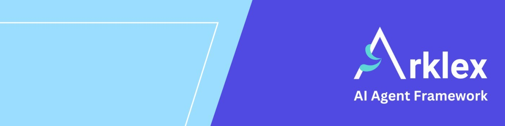
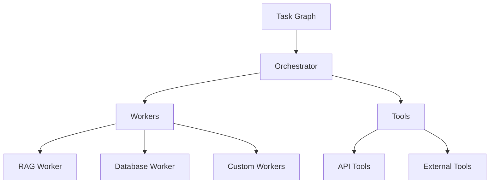

# 🧠 Arklex AI · Agent-First Framework

<div align="center">



**Build, deploy, and scale intelligent AI agents with enterprise-grade reliability**

[](https://github.com/arklexai/Agent-First-Organization/releases)
[](https://pypi.org/project/arklex)
[](https://pypi.org/project/arklex)
[](LICENSE.md)
[](https://discord.gg/kJkefzkRg5)


🚀 [Quick Start](#-get-started-in-5-minutes) • 📚 [Documentation](https://arklexai.github.io/Agent-First-Organization/) • 💡 [Examples](./examples/)

</div>

---

## 🚀 Get Started in 5 Minutes

### Install & Setup

```bash
# Install
pip install arklex

# Create .env file
echo "OPENAI_API_KEY=your_key_here" > .env

# Test your API keys (recommended)
python test_api_keys.py

# Create your first agent
python create.py \
  --config ./examples/customer_service/customer_service_config.json \
  --output-dir ./examples/customer_service \
  --llm_provider openai \
  --model gpt-4o

# Run agent
python run.py \
  --input-dir ./examples/customer_service \
  --llm_provider openai \
  --model gpt-4o

# For evaluation and testing, you can also use the model API server:
# 1. Start the model API server (defaults to OpenAI with "gpt-4o-mini" model):
python model_api.py --input-dir ./examples/customer_service

# 2. Run evaluation (in a separate terminal):
python eval.py --model_api http://127.0.0.1:8000/eval/chat \
  --config "examples/customer_service/customer_service_config.json" \
  --documents_dir "examples/customer_service" \
  --model "claude-3-haiku-20240307" \
  --llm_provider "anthropic" \
  --task "all"
```

▶️ **[Watch: Build a Customer Service Agent in 20 Minutes](https://youtu.be/y1P2Ethvy0I)**

---

## ⚡ Key Features

- **🚀 90% Faster Development** — Deploy agents in days, not months
- **🧠 Agent-First Design** — Purpose-built for multi-agent orchestration
- **🔌 Model Agnostic** — OpenAI, Anthropic, Gemini, and more
- **📊 Built-in Evaluation** — Comprehensive testing suite
- **🛡️ Enterprise Security** — Authentication and rate limiting
- **⚡ Production Ready** — Monitoring, logging, auto-scaling

---

## 🏗️ Architecture



**Core Components:**

- **Task Graph** — Declarative DAG workflows
- **Orchestrator** — Runtime engine with state management
- **Workers** — RAG, database, web automation
- **Tools** — Shopify, HubSpot, Google Calendar integrations

---

## 💡 Use Cases

| **Domain** | **Capabilities** |
|------------|------------------|
| **Customer Service** | RAG chatbots, ticket routing, support workflows |
| **E-commerce** | Order management, inventory tracking, recommendations |
| **Business Process** | Scheduling, CRM operations, document processing |

---

## 📚 Examples

| **Example** | **Description** | **Complexity** |
|-------------|-----------------|----------------|
| [Customer Service](./examples/customer_service/) | RAG-powered support | ⭐⭐ |
| [Shopify Integration](./examples/shopify/) | E-commerce management | ⭐⭐⭐ |
| [HubSpot CRM](./examples/hubspot/) | Contact management | ⭐⭐⭐ |
| [Calendar Booking](./examples/calendar/) | Scheduling system | ⭐⭐ |
| [Human-in-the-Loop](./examples/hitl_server/) | Interactive workflows | ⭐⭐⭐⭐ |

---

## 🔧 Configuration

**Requirements:** Python 3.10+, API keys

```env
# Required: Choose one or more LLM providers
OPENAI_API_KEY=your_key_here
# OR ANTHROPIC_API_KEY=your_key_here
# OR GOOGLE_API_KEY=your_key_here

# Optional: Enhanced features
MILVUS_URI=your_milvus_uri
MYSQL_USERNAME=your_username
TAVILY_API_KEY=your_tavily_key
```

**Testing API Keys:**
After adding your API keys to the `.env` file, run the test script to verify they work correctly:

```bash
# Test all configured API keys
python test_api_keys.py

# Test specific providers only
python test_api_keys.py --providers openai gemini
python test_api_keys.py --providers openai anthropic
```

---

## 📖 Documentation

- 📚 **[Full Documentation](https://arklexai.github.io/Agent-First-Organization/)**
- 🚀 **[Quick Start](docs/QUICKSTART.md)**
- 🛠️ **[API Reference](docs/API.md)**
- 🏗️ **[Architecture](docs/ARCHITECTURE.md)**
- 🚀 **[Deployment](docs/DEPLOYMENT.md)**

---

## 🤝 Community

- 🐛 [Report Issues](https://github.com/arklexai/Agent-First-Organization/issues)
- 💬 [Discord](https://discord.gg/kJkefzkRg5)
- 🐦 [Twitter](https://twitter.com/arklexai)
- 💼 [LinkedIn](https://www.linkedin.com/company/arklex)
- 📧 [Email Support](mailto:support@arklex.ai)

---

## 📄 License

Arklex AI is released under the **MIT License**. See [LICENSE](LICENSE.md) for details.

This means you can:

- ✅ Use Arklex AI for commercial projects
- ✅ Modify and distribute the code
- ✅ Use it in proprietary applications
- ✅ Sell applications built with Arklex AI

The only requirement is that you include the original license and copyright notice.

---

## 🙏 Acknowledgments

Thanks to all our contributors and the open-source community for making this project possible!

### 🌟 Contributors

<a href="https://github.com/arklexai/Agent-First-Organization/graphs/contributors">
  
</a>

### 🤝 Open Source Dependencies

Arklex AI builds on the shoulders of giants:

- **LangChain** — LLM framework and tooling
- **FastAPI** — Modern web framework
- **Pydantic** — Data validation
- **SQLAlchemy** — Database ORM
- **Milvus** — Vector database
- **And many more...**

---

<div align="center">

**Made with ❤️ by the Arklex AI Team**

[Website](https://arklex.ai) • [Documentation](https://arklexai.github.io/Agent-First-Organization/) • [GitHub](https://github.com/arklexai/Agent-First-Organization) • [Discord](https://discord.gg/kJkefzkRg5) • [LinkedIn](https://www.linkedin.com/company/arklex)

</div>
