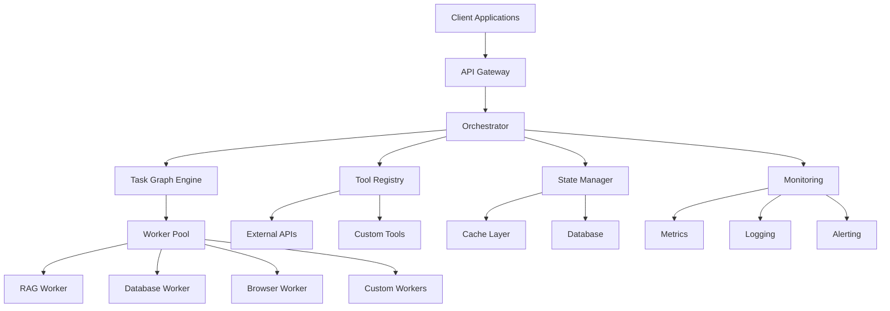
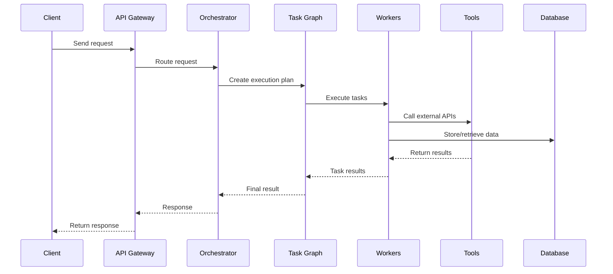

# 🏗️ Architecture Guide

Deep dive into Arklex AI's system architecture, design principles, and component interactions.

## 📋 Table of Contents

- [System Overview](#-system-overview)
- [Core Components](#-core-components)
- [Data Flow](#-data-flow)
- [Scalability Design](#-scalability-design)
- [Security Architecture](#-security-architecture)
- [Performance Optimization](#-performance-optimization)

## 🎯 System Overview

Arklex AI follows a modular, event-driven architecture designed for scalability, reliability, and extensibility.

### High-Level Architecture



### Design Principles

1. **Modularity** — Components are loosely coupled and independently deployable
2. **Scalability** — Horizontal scaling with auto-scaling capabilities
3. **Reliability** — Fault tolerance with circuit breakers and retry mechanisms
4. **Extensibility** — Plugin architecture for custom workers and tools
5. **Observability** — Comprehensive monitoring and logging
6. **Security** — Defense in depth with multiple security layers

## 🔧 Core Components

### Orchestrator

The central coordination component that manages workflow execution.

```python
class Orchestrator:
    def __init__(self, llm_provider, model, api_key, **kwargs):
        self.llm_client = self._create_llm_client(llm_provider, model, api_key)
        self.workers = {}
        self.tools = {}
        self.middleware = []
        self.state_manager = StateManager()
        self.monitoring = Monitoring()
    
    def run(self, task_graph, query, context=None):
        """Execute task graph with given query"""
        # Initialize execution context
        execution_context = ExecutionContext(query, context)
        
        # Apply middleware
        for middleware in self.middleware:
            execution_context = middleware.process(execution_context)
        
        # Execute task graph
        result = self.task_graph_engine.execute(task_graph, execution_context)
        
        # Update monitoring
        self.monitoring.record_execution(result)
        
        return result
```

**Key Responsibilities:**

- **Workflow Management** — Coordinate task execution
- **State Management** — Maintain execution state
- **Error Handling** — Implement retry and fallback logic
- **Monitoring** — Track performance and errors
- **Security** — Enforce access controls and validation

### Task Graph Engine

Manages the execution of declarative workflow graphs.

```python
class TaskGraphEngine:
    def __init__(self):
        self.execution_plan = {}
        self.dependency_resolver = DependencyResolver()
        self.executor = TaskExecutor()
    
    def execute(self, task_graph, context):
        """Execute task graph"""
        # Build execution plan
        execution_plan = self.dependency_resolver.resolve(task_graph)
        
        # Execute tasks in dependency order
        results = {}
        for task_id in execution_plan:
            task = task_graph.get_task(task_id)
            result = self.executor.execute(task, context, results)
            results[task_id] = result
        
        return results
```

**Key Features:**

- **Dependency Resolution** — Topological sorting of tasks
- **Parallel Execution** — Execute independent tasks concurrently
- **Error Recovery** — Handle task failures gracefully
- **State Persistence** — Save intermediate results

### Worker Pool

Manages specialized workers for different types of tasks.

```python
class WorkerPool:
    def __init__(self, max_workers=4):
        self.workers = {}
        self.max_workers = max_workers
        self.executor = ThreadPoolExecutor(max_workers=max_workers)
    
    def add_worker(self, worker_type, worker_instance):
        """Add worker to pool"""
        self.workers[worker_type] = worker_instance
    
    def execute_task(self, task_type, task_data):
        """Execute task using appropriate worker"""
        if task_type not in self.workers:
            raise WorkerNotFoundError(f"Worker not found: {task_type}")
        
        worker = self.workers[task_type]
        return worker.execute(task_data)
```

**Worker Types:**

- **RAG Worker** — Document retrieval and question answering
- **Database Worker** — SQL operations and data persistence
- **Browser Worker** — Web automation and scraping
- **Custom Workers** — Domain-specific processing

### Tool Registry

Manages external tool integrations and API connections.

```python
class ToolRegistry:
    def __init__(self):
        self.tools = {}
        self.api_clients = {}
        self.rate_limiters = {}
    
    def register_tool(self, tool_name, tool_instance):
        """Register tool with registry"""
        self.tools[tool_name] = tool_instance
        
        # Initialize rate limiter if needed
        if hasattr(tool_instance, 'rate_limit'):
            self.rate_limiters[tool_name] = RateLimiter(tool_instance.rate_limit)
    
    def execute_tool(self, tool_name, input_data):
        """Execute tool with rate limiting"""
        if tool_name not in self.tools:
            raise ToolNotFoundError(f"Tool not found: {tool_name}")
        
        # Check rate limits
        if tool_name in self.rate_limiters:
            self.rate_limiters[tool_name].acquire()
        
        tool = self.tools[tool_name]
        return tool.execute(input_data)
```

## 🔄 Data Flow

### Request Processing Flow



### State Management Flow

```python
class StateManager:
    def __init__(self, cache_backend=None, db_backend=None):
        self.cache = cache_backend or MemoryCache()
        self.database = db_backend or SQLiteDatabase()
        self.state_store = {}
    
    def get_state(self, session_id):
        """Get execution state for session"""
        # Try cache first
        state = self.cache.get(f"state:{session_id}")
        if state:
            return state
        
        # Fallback to database
        state = self.database.get_state(session_id)
        if state:
            self.cache.set(f"state:{session_id}", state)
        
        return state
    
    def update_state(self, session_id, updates):
        """Update execution state"""
        current_state = self.get_state(session_id) or {}
        new_state = {**current_state, **updates}
        
        # Update both cache and database
        self.cache.set(f"state:{session_id}", new_state)
        self.database.save_state(session_id, new_state)
```

## ⚡ Scalability Design

### Horizontal Scaling

```python
class ScalableOrchestrator:
    def __init__(self, config):
        self.load_balancer = LoadBalancer()
        self.auto_scaler = AutoScaler(config)
        self.health_checker = HealthChecker()
    
    def handle_request(self, request):
        """Handle incoming request with load balancing"""
        # Get healthy orchestrator instance
        orchestrator = self.load_balancer.get_next_healthy()
        
        # Execute request
        try:
            result = orchestrator.run(request.task_graph, request.query)
            return result
        except Exception as e:
            # Mark instance as unhealthy and retry
            self.health_checker.mark_unhealthy(orchestrator)
            return self.handle_request(request)  # Retry with different instance
```

### Auto-scaling Configuration

```python
class AutoScaler:
    def __init__(self, config):
        self.min_instances = config.get('min_instances', 2)
        self.max_instances = config.get('max_instances', 10)
        self.scale_up_threshold = config.get('scale_up_threshold', 0.8)
        self.scale_down_threshold = config.get('scale_down_threshold', 0.2)
        self.cooldown_period = config.get('cooldown_period', 300)
    
    def check_scaling_needs(self, metrics):
        """Check if scaling is needed"""
        cpu_usage = metrics.get('cpu_usage', 0)
        memory_usage = metrics.get('memory_usage', 0)
        queue_length = metrics.get('queue_length', 0)
        
        # Calculate load score
        load_score = (cpu_usage + memory_usage) / 2
        
        if load_score > self.scale_up_threshold:
            return 'scale_up'
        elif load_score < self.scale_down_threshold:
            return 'scale_down'
        
        return 'maintain'
```

### Caching Strategy

```python
class MultiLevelCache:
    def __init__(self):
        self.l1_cache = MemoryCache()  # Fast, small
        self.l2_cache = RedisCache()   # Medium speed, larger
        self.l3_cache = DatabaseCache() # Slow, persistent
    
    def get(self, key):
        """Get value from multi-level cache"""
        # Try L1 cache first
        value = self.l1_cache.get(key)
        if value:
            return value
        
        # Try L2 cache
        value = self.l2_cache.get(key)
        if value:
            self.l1_cache.set(key, value)  # Populate L1
            return value
        
        # Try L3 cache
        value = self.l3_cache.get(key)
        if value:
            self.l2_cache.set(key, value)  # Populate L2
            self.l1_cache.set(key, value)  # Populate L1
            return value
        
        return None
```

## 🔐 Security Architecture

### Authentication & Authorization

```python
class SecurityManager:
    def __init__(self, config):
        self.jwt_secret = config.get('jwt_secret')
        self.api_keys = config.get('api_keys', {})
        self.rate_limiters = {}
    
    def authenticate_request(self, request):
        """Authenticate incoming request"""
        # Check API key
        api_key = request.headers.get('X-API-Key')
        if api_key and api_key in self.api_keys:
            return self.api_keys[api_key]
        
        # Check JWT token
        auth_header = request.headers.get('Authorization')
        if auth_header and auth_header.startswith('Bearer '):
            token = auth_header.split(' ')[1]
            return self.verify_jwt(token)
        
        raise AuthenticationError("Invalid credentials")
    
    def authorize_action(self, user, action, resource):
        """Authorize user action on resource"""
        # Implement role-based access control
        user_roles = self.get_user_roles(user)
        required_permissions = self.get_required_permissions(action, resource)
        
        for role in user_roles:
            if self.has_permission(role, required_permissions):
                return True
        
        raise AuthorizationError("Insufficient permissions")
```

### Input Validation

```python
class InputValidator:
    def __init__(self, config):
        self.max_query_length = config.get('max_query_length', 10000)
        self.allowed_file_types = config.get('allowed_file_types', [])
        self.max_file_size = config.get('max_file_size', 10485760)
    
    def validate_query(self, query):
        """Validate user query"""
        if not query or len(query.strip()) == 0:
            raise ValidationError("Query cannot be empty")
        
        if len(query) > self.max_query_length:
            raise ValidationError(f"Query too long (max {self.max_query_length} characters)")
        
        # Check for potentially malicious content
        if self.contains_malicious_content(query):
            raise ValidationError("Query contains potentially malicious content")
        
        return query.strip()
    
    def validate_file(self, file):
        """Validate uploaded file"""
        if file.size > self.max_file_size:
            raise ValidationError(f"File too large (max {self.max_file_size} bytes)")
        
        file_extension = file.name.split('.')[-1].lower()
        if file_extension not in self.allowed_file_types:
            raise ValidationError(f"File type not allowed: {file_extension}")
        
        return True
```

### Rate Limiting

```python
class RateLimiter:
    def __init__(self, requests_per_minute, burst_size=None):
        self.requests_per_minute = requests_per_minute
        self.burst_size = burst_size or requests_per_minute
        self.requests = defaultdict(list)
        self.lock = threading.Lock()
    
    def acquire(self, client_id):
        """Acquire rate limit token"""
        with self.lock:
            now = time.time()
            client_requests = self.requests[client_id]
            
            # Remove old requests
            client_requests[:] = [req_time for req_time in client_requests 
                                if now - req_time < 60]
            
            # Check rate limit
            if len(client_requests) >= self.requests_per_minute:
                raise RateLimitExceeded("Rate limit exceeded")
            
            # Add current request
            client_requests.append(now)
            return True
```

## 🚀 Performance Optimization

### Connection Pooling

```python
class DatabaseConnectionPool:
    def __init__(self, connection_string, pool_size=10, max_overflow=20):
        self.connection_string = connection_string
        self.pool_size = pool_size
        self.max_overflow = max_overflow
        self.pool = Queue(maxsize=pool_size + max_overflow)
        self.active_connections = 0
        self.lock = threading.Lock()
    
    def get_connection(self):
        """Get database connection from pool"""
        try:
            # Try to get existing connection
            connection = self.pool.get_nowait()
            return connection
        except Empty:
            # Create new connection if pool not full
            with self.lock:
                if self.active_connections < self.pool_size + self.max_overflow:
                    connection = self.create_connection()
                    self.active_connections += 1
                    return connection
                else:
                    # Wait for available connection
                    return self.pool.get()
    
    def return_connection(self, connection):
        """Return connection to pool"""
        try:
            self.pool.put_nowait(connection)
        except Full:
            # Pool is full, close connection
            connection.close()
            with self.lock:
                self.active_connections -= 1
```

### Async Processing

```python
class AsyncTaskProcessor:
    def __init__(self, max_concurrent_tasks=10):
        self.semaphore = asyncio.Semaphore(max_concurrent_tasks)
        self.task_queue = asyncio.Queue()
        self.workers = []
    
    async def start_workers(self, num_workers=4):
        """Start async worker processes"""
        for _ in range(num_workers):
            worker = asyncio.create_task(self.worker())
            self.workers.append(worker)
    
    async def worker(self):
        """Async worker process"""
        while True:
            task = await self.task_queue.get()
            try:
                async with self.semaphore:
                    result = await self.process_task(task)
                    task.set_result(result)
            except Exception as e:
                task.set_exception(e)
            finally:
                self.task_queue.task_done()
    
    async def submit_task(self, task_data):
        """Submit task for async processing"""
        task = asyncio.Future()
        await self.task_queue.put((task, task_data))
        return await task
```

### Memory Management

```python
class MemoryManager:
    def __init__(self, max_memory_usage=0.8):
        self.max_memory_usage = max_memory_usage
        self.memory_monitor = MemoryMonitor()
        self.gc_enabled = False
    
    def check_memory_usage(self):
        """Check current memory usage"""
        memory_usage = self.memory_monitor.get_memory_usage()
        
        if memory_usage > self.max_memory_usage:
            self.trigger_memory_cleanup()
        
        return memory_usage
    
    def trigger_memory_cleanup(self):
        """Trigger memory cleanup"""
        # Enable garbage collection
        if not self.gc_enabled:
            gc.enable()
            self.gc_enabled = True
        
        # Force garbage collection
        gc.collect()
        
        # Clear caches if needed
        if self.memory_monitor.get_memory_usage() > self.max_memory_usage:
            self.clear_caches()
    
    def clear_caches(self):
        """Clear various caches to free memory"""
        # Clear worker caches
        for worker in self.workers.values():
            if hasattr(worker, 'clear_cache'):
                worker.clear_cache()
        
        # Clear tool caches
        for tool in self.tools.values():
            if hasattr(tool, 'clear_cache'):
                tool.clear_cache()
```

---

For more detailed information on specific components, see the [API Reference](API.md) and [Deployment Guide](DEPLOYMENT.md).
